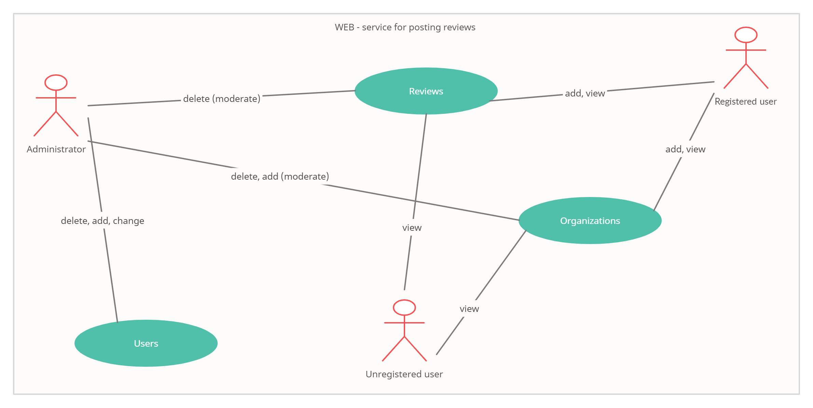
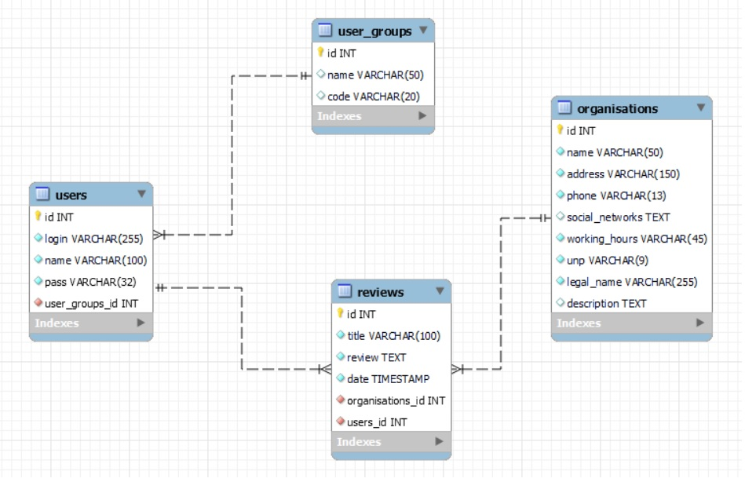
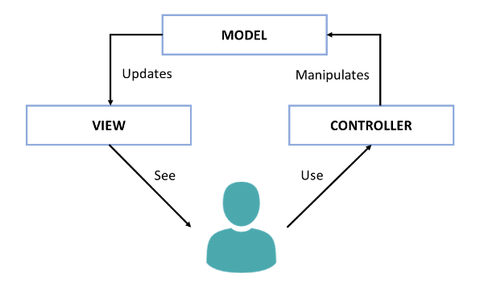
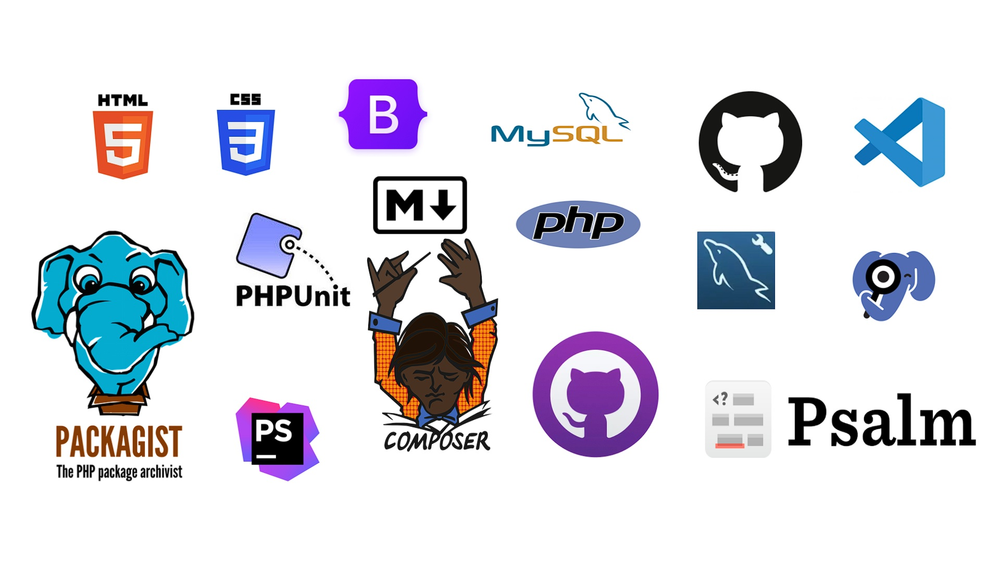
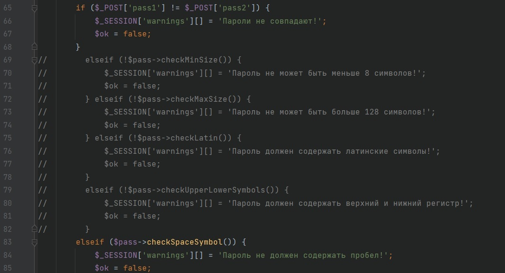
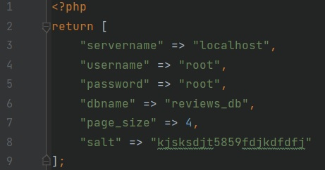

# WEB - service for posting reviews

___

## Project theme

The service is designed to collect feedback on the organizations represented. It is possible to add new organizations by
the user (owner of the organization). Editing of information about existing organizations is carried out by the
administrator.
___

## Use Case diagram

___

## ER diagram

___

## Patterns

### Front controller

The front controller software design pattern is listed in several pattern catalogs and related to the design of web
applications. It is "a controller that handles all requests for a website", which is a useful structure for web
application developers to achieve flexibility and reuse without code redundancy.

___

### Model View Controller

**Model-View-Controller (MVC)** - a scheme for dividing application data and control logic into three separate
components:
model, view and controller - so that modification of each component can be carried out independently.

___

## Programming languages and technologies

---

## Deploying the project

To deploy a project on a local machine, there is a test DB dump in the root of the repository.  
Admin:  
admin - login  
123 - pass  
For the authorization module to work properly, the following should be uncommented:  
Route: myproject/src/Controller/AutController

___
To change the parameters for connecting to the DB, page size and salt, edit the Config.php file located at the root of
the project.  
